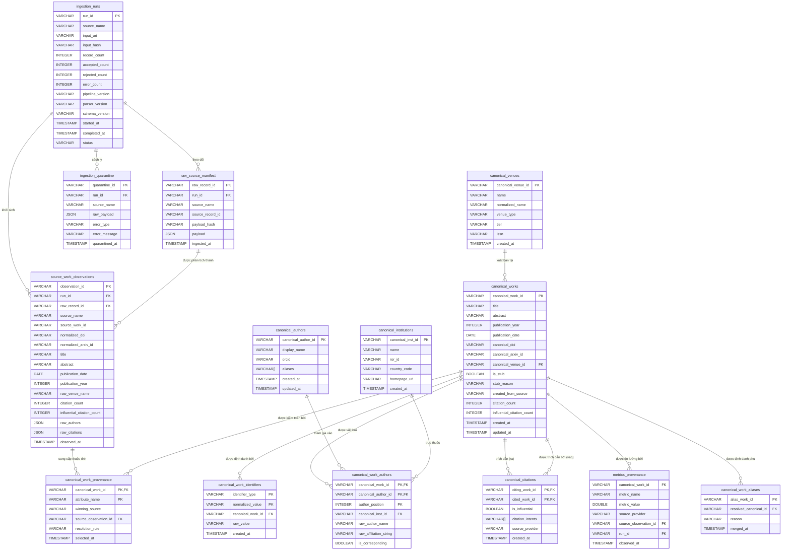

# Kiến trúc Nền tảng Dữ liệu Học thuật & Thiết kế Cơ sở Dữ liệu
(Scholarly Data Platform Architecture & Database Design)

---

## 1. Tóm tắt Điều hành & Mục tiêu (Executive Summary & Goals)

### 1.1 Mục tiêu Cốt lõi
**Nền tảng Dữ liệu Học thuật Chuẩn hóa (Canonical Scholarly Data Platform)** là phân hệ chịu trách nhiệm thu thập, chuẩn hóa, điều hòa và lưu trữ dữ liệu phân tích có độ toàn vẹn cao cho dự án *Khai phá Xu hướng Công nghệ (Technological Trend Mining)*. Được vận hành bởi công cụ OLAP nhúng **DuckDB**, nền tảng cung cấp:
1. **Thu thập Đa nguồn (Multi-Source Ingestion)**: Thu thập dữ liệu đáng tin cậy, có tính lũy đẳng (idempotent) đối với các bản ghi học thuật từ **arXiv**, **OpenAlex**, **Crossref**, và **Semantic Scholar (S2AG)**.
2. **Hài hòa Thực thể Chuẩn hóa (Canonical Entity Harmonization)**: Phân giải thực thể mang tính xác định (deterministic entity resolution) nhằm tổng hợp các quan sát nguồn không đồng nhất thành biểu diễn chuẩn hóa duy nhất cho các thực thể Bài báo (Works), Tác giả (Authors), Viện/Trường nghiên cứu (Institutions) và Nơi xuất bản (Venues).
3. **Truy vết Dòng dữ liệu & Nguồn gốc Đa tầng Không mất mát thông tin (Lossless Multi-Tier Lineage & Provenance)**: Khả năng kiểm toán toàn diện, truy vết từng thuộc tính chuẩn hóa trở về chính xác `source_observation_id`, `run_id`, mốc thời gian quan sát nguồn và mã băm SHA-256 của payload thô.
4. **Tính Toàn vẹn của Đồ thị Trích dẫn & Vòng đời Nâng cấp Stub (Citation Graph Integrity & Stub Upgrade Lifecycle)**: Biểu diễn mạnh mẽ đồ thị trích dẫn có hướng, xử lý các cạnh lơ lửng trong thế giới mở (open-world dangling edges) thông qua các thực thể thế chỗ (`is_stub = TRUE`) và nâng cấp tại chỗ (in-place) liền mạch khi siêu dữ liệu của bài báo đích được nạp vào hệ thống.
5. **Phân tích Hiệu năng Cao (High-Performance Analytics)**: Thực thi truy vấn phân tích SQL dưới 1 giây cho các bài toán khai phá xu hướng công nghệ, tính toán tốc độ tăng trưởng trích dẫn (citation velocity) và xếp hạng uy tín của hội thảo/tạp chí.

### 1.2 Những mục tiêu Không thuộc phạm vi (Non-Goals)
* **Không dùng Message Broker Streaming Thời gian Thực**: Hệ thống vận hành theo cơ chế nạp theo lô (batch) và vi lô (micro-batch) từ các tệp JSONL hoặc bản kết xuất API. Kafka/Flink nằm ngoài phạm vi thiết kế.
* **Không vội vã đưa vào Cơ sở dữ liệu Đồ thị / Vector Bên ngoài**: DuckDB tự quản lý duyệt đồ thị trích dẫn và siêu dữ liệu dạng bảng. Việc triển khai bên ngoài như Neo4j hoặc Qdrant được hoãn lại cho đến khi việc tìm kiếm theo embedding hoặc khai phá đồ thị đa bước vượt quá khả năng xử lý in-process của DuckDB.
* **Không dùng Hạ tầng Phân tán Spark/Hadoop**: Quy mô tập dữ liệu mục tiêu (lên đến hàng chục triệu bản ghi) được xử lý hiệu quả trên phần cứng đơn node thông qua công cụ dạng cột được vector hóa của DuckDB.
* **Không Thu thập Web Trực tiếp hay Cào Toàn văn PDF**: Quá trình nạp dữ liệu chỉ vận hành hoàn toàn trên siêu dữ liệu API có cấu trúc hoặc bán cấu trúc.

---

## 2. Yêu cầu & Ràng buộc (Requirements & Constraints)

### 2.1 Yêu cầu Chức năng (Functional Requirements)
* **FR-01 (Truy vết Cấp độ Lần chạy - Run-Level Lineage)**: Mỗi thao tác thu thập tạo ra một bản ghi `ingestion_runs` bất biến, theo dõi URI đầu vào, mã băm SHA-256, phiên bản pipeline/parser/schema và số lượng bản ghi.
* **FR-02 (Phân tích cú pháp Đa nguồn - Multi-Source Parsing)**: Hỗ trợ nạp dữ liệu từ các bản trích xuất arXiv OAI-PMH JSON/XML, OpenAlex REST JSON/S3, Crossref JSON và Semantic Scholar S2AG JSONL.
* **FR-03 (Phân giải Bài báo Chuẩn hóa - Canonical Work Resolution)**: Hợp nhất các bản ghi có cùng DOI hoặc cùng arXiv ID thành một thực thể bài báo chuẩn hóa duy nhất.
* **FR-04 (Nâng cấp Stub thành Chuẩn hóa - Stub-to-Canonical Upgrade)**: Tự động nâng cấp các thực thể trích dẫn thế chỗ (`is_stub = TRUE`) thành các bài báo chuẩn hóa đầy đủ khi siêu dữ liệu nguồn trùng khớp xuất hiện, bảo toàn toàn bộ khóa ngoại hiện có.
* **FR-05 (Cách ly & Cách ly Lỗi - Quarantine & Rejection)**: Chuyển hướng các bản ghi sai định dạng hoặc không hợp lệ vào bảng `ingestion_quarantine` mà không làm dừng quá trình xử lý toàn bộ lô dữ liệu.
* **FR-06 (Duyệt Đồ thị Trích dẫn - Citation Graph Traversal)**: Hỗ trợ duyệt nhanh đồ thị trích dẫn vào và ra (inbound/outbound), hỗ trợ phân loại ý định trích dẫn (`Methodology`, `Background`, `Result`) và các nhãn trích dẫn có tầm ảnh hưởng (influential flags).
* **FR-07 (Ảnh chụp Chỉ số theo Thời gian - Temporal Metrics Snapshots)**: Theo dõi lịch sử quan sát của các chỉ số biến đổi theo thời gian (ví dụ: `citation_count`, `influential_citation_count`) cùng mốc thời gian quan sát.
* **FR-08 (Tính Lũy đẳng Xác định - Deterministic Idempotency)**: Việc chạy lại quá trình nạp dữ liệu trên bất kỳ tệp hoặc lô dữ liệu nào không được tạo ra các hàng trùng lặp, không làm thay đổi khóa đại diện (surrogate keys), và không làm sai lệch tính toàn vẹn tham chiếu.

### 2.2 Yêu cầu Phi Chức năng & Ràng buộc (Non-Functional Requirements & Constraints)
* **NFR-01 (Tính Nhất quán ACID)**: Các lô nạp dữ liệu phải commit mang tính nguyên tử (atomic) bên trong các transaction của DuckDB (`BEGIN TRANSACTION ... COMMIT`).
* **NFR-02 (Lưu trữ Dạng cột Vector hóa - Vectorized Columnar Storage)**: Các bảng phân tích tầng Gold phải nằm ở định dạng cột gốc của DuckDB với độ nén tối ưu và zone maps min/max.
* **NFR-03 (Khả năng Kiểm toán & Tái lập - Auditability & Reproducibility)**: Đối với bất kỳ bài báo chuẩn hóa nào, hệ thống phải xác định được những nguồn nào đã quan sát thấy nó và bản ghi quan sát nào đã cung cấp từng thuộc tính cụ thể.
* **NFR-04 (Xử lý Đồng thời Đơn-Writer - Single-Writer Concurrency)**: Tuân thủ mô hình kiến trúc của DuckDB: tuần tự hóa tất cả các giao dịch ghi trong khi cho phép nhiều tiến trình đọc phân tích đồng thời.
* **NFR-05 (Ghim Phiên bản Phụ thuộc - Pinned Dependency)**: Phiên bản công cụ được ghim chặt chẽ vào `duckdb==1.5.5` trong `pyproject.toml` và được xác minh qua `uv.lock`.

---

## 3. Kiến trúc Hệ thống & Cấu trúc Thành phần (System Architecture & Component Topology)

```mermaid
flowchart TD
    subgraph Data Sources [Nguồn Dữ liệu]
        S_ARXIV[arXiv OAI-PMH / JSON]
        S_OA[OpenAlex JSON / S3]
        S_CR[Crossref API / JSON]
        S_S2[Semantic Scholar S2AG JSONL]
    end

    subgraph Bronze Layer: Hybrid Raw Files & Manifest [Tầng Bronze: Tệp Thô Kết hợp & Manifest]
        B_FILES[(Tệp Thô Bất biến<br/>data/bronze/...)]
        B_RUNS[ingestion_runs<br/>run_id, source, input_hash, versions, counts]
        B_RAW[raw_source_manifest<br/>manifest_id, run_id, payload_hash, payload]
        B_QUAR[ingestion_quarantine<br/>quarantine_id, run_id, payload, error_type]
    end

    subgraph Silver Layer: Normalized Observations [Tầng Silver: Quan sát Chuẩn hóa]
        OBS_W[source_work_observations<br/>observation_id, run_id, source_work_id, typed attrs]
        OBS_C[source_citation_observations<br/>citing_id, cited_id, intents, is_influential]
        OBS_A[source_author_observations<br/>raw_name, raw_affiliation, orcid, ror]
    end

    subgraph Resolution Engine [Bộ máy Phân giải Thực thể]
        RES_NORM[Chuẩn hóa Định danh: DOI, arXiv, ORCID, ROR]
        RES_MATCH[Bộ Phân giải Thực thể Đa bước Xác định]
        RES_POL[Ma trận Ưu tiên Nguồn Thẩm quyền]
        RES_STUB[Bộ máy Tạo Stub & Nâng cấp Tại chỗ]
    end

    subgraph Gold Layer: Canonical Relational Core [Tầng Gold: Lõi Quan hệ Chuẩn hóa]
        C_WORKS[canonical_works<br/>canonical_work_id, title, is_stub, canonical_doi]
        C_IDENT[canonical_work_identifiers<br/>id_type, normalized_value, canonical_work_id]
        C_AUTHORS[canonical_authors<br/>canonical_author_id, display_name, orcid]
        C_INST[canonical_institutions<br/>canonical_inst_id, name, ror_id]
        C_VENUES[canonical_venues<br/>canonical_venue_id, name, tier]
        C_WA[canonical_work_authors<br/>canonical_work_id, canonical_author_id, position]
        C_CITES[canonical_citations<br/>citing_work_id, cited_work_id, is_influential]
        C_PROV[canonical_work_provenance<br/>canonical_work_id, attribute_name, source_observation_id]
        C_METRICS[metrics_provenance<br/>canonical_work_id, metric_name, value, observed_at, run_id]
    end

    subgraph Downstream Analytics [Phân tích Xuôi dòng]
        A_TRENDS[Bộ máy Khai phá Xu hướng Công nghệ]
        A_VELOCITY[Tốc độ & Gia tốc Trích dẫn]
        A_NETWORKS[Mạng lưới Đồng tác giả & Viện nghiên cứu]
    end

    Data Sources -->|Lưu trữ Thô & Băm Hash| B_FILES
    B_FILES -->|Đăng ký Lần chạy| B_RUNS
    B_FILES -->|Stream JSONL| B_RAW
    B_RAW -->|Phân tích Cú pháp & Cổng DQ| Silver Layer
    B_RAW -.->|Sai định dạng / Không hợp lệ| B_QUAR
    Silver Layer --> RES_NORM
    RES_NORM --> RES_MATCH
    RES_MATCH --> RES_POL
    RES_POL --> RES_STUB
    RES_STUB -->|Giao dịch Nguyên tử Xác định| Gold Layer
    Gold Layer --> Downstream Analytics
```

---

## 4. Luồng Dữ liệu Đầu-Cuối (End-to-End Data Flow)

```mermaid
sequenceDiagram
    autonumber
    participant SRC as Nguồn Ngoài / Tệp (JSONL)
    participant ING as Điều phối viên Ingestion (Coordinator)
    participant RUN as Bronze: ingestion_runs
    participant RAW as Bronze: raw_source_manifest
    participant QUAR as Bronze: ingestion_quarantine
    participant OBS as Silver: source_work_observations
    participant RES as Bộ máy Phân giải & Stub
    participant GOLD as Gold: Các bảng Chuẩn hóa (DuckDB)

    ING->>RUN: 1. Tạo ingestion_run (RECORDING_STARTED, input_hash, versions)
    ING->>RAW: 2. Stream dữ liệu thô; xác thực mã băm SHA-256
    alt Dữ liệu Lỗi định dạng hoặc Vi phạm DQ Nghiêm trọng (DQ-02)
        ING->>QUAR: Chuyển bản ghi sang quarantine với error_type & message
    else Dữ liệu Hợp lệ
        ING->>OBS: 3. Chèn bản ghi quan sát có kiểu (gắn với run_id & source_work_id)
        OBS->>RES: 4. Trích xuất các khóa nguồn đã chuẩn hóa (doi, arxiv, s2)
        RES->>GOLD: 5. Truy vấn canonical_work_identifiers để tìm khớp khóa chính xác
        alt Tìm thấy Khớp hiện có (hoặc Bài báo Đích dạng Stub)
            alt Bản ghi là Mục tiêu Stub (is_stub == TRUE)
                RES->>GOLD: 6a. Nâng cấp stub tại chỗ (is_stub=FALSE, cập nhật metadata)
            else Bài báo Bình thường Hiện có
                RES->>GOLD: 6b. Áp dụng Ma trận Ưu tiên Nguồn (cập nhật các trường thắng thế)
            end
            RES->>GOLD: 7. Liên kết định danh mới & cập nhật canonical_work_provenance
        else Không tìm thấy Khớp
            RES->>GOLD: 6c. Khởi tạo canonical_work_id = UUIDv5(NAMESPACE, primary_key)
            RES->>GOLD: 7. Chèn canonical_works mới & đăng ký tất cả các khóa
        end
        RES->>GOLD: 8. Chèn canonical_work_authors, canonical_venues, và institutions
        RES->>GOLD: 9. Upsert canonical_citations (Tự động tạo stub nếu bài được trích dẫn chưa nạp)
        RES->>GOLD: 10. Ghi thêm ảnh chụp chỉ số vào metrics_provenance
    end
    ING->>RUN: 11. Hoàn tất ingestion_run (COMPLETED, tổng số bản ghi)
```

---

## 5. Đánh giá & Phê bình Đề xuất Ban đầu (Critique of Initial Proposal)

### 5.1 Ma trận Đánh giá Giả định (Assumption Evaluation Matrix)

| Hạng mục Đề xuất Ban đầu | Kết luận | Cơ sở Lý luận & Giải pháp Kỹ thuật Chuẩn xác |
| :--- | :--- | :--- |
| **`external_ids STRUCT[]` trong `works`** | **BÁC BỎ (REJECT)** | Không thể thực thi ràng buộc quan hệ `UNIQUE` trên các phần tử mảng trong DuckDB. Phân giải thực thể đa bước và tra cứu ngược sẽ đòi hỏi quét mảng tốn kém và không thể đánh chỉ mục. <br/>*Giải pháp*: Bảng riêng biệt `canonical_work_identifiers` với khóa chính phức hợp `(identifier_type, normalized_value)`. Đồng thời tạo cột `canonical_doi` và `canonical_arxiv_id` trực tiếp trên `canonical_works`. |
| **Chỉ dùng `metrics_provenance` làm bảng nguồn gốc duy nhất** | **SỬA ĐỔI (MODIFY)** | Không ghi nhận được nguồn gốc ở cấp độ thuộc tính cho các siêu dữ liệu cốt lõi (tiêu đề, tóm tắt, nơi xuất bản, năm xuất bản). <br/>*Giải pháp*: Giữ lại `metrics_provenance` cho các chỉ số biến đổi theo chuỗi thời gian (append-only), nhưng bổ sung bảng `canonical_work_provenance` tham chiếu tới `source_observation_id` để truy vết nguồn gốc từng thuộc tính. |
| **Sử dụng ngây thơ `ON CONFLICT DO UPDATE`** | **BÁC BỎ (REJECT)** | Cập nhật mù quáng các hàng `works` khi xung đột gây ra **mất dữ liệu cập nhật (lost updates)**: một quan sát preprint thưa thớt sẽ ghi đè các viện nghiên cứu và trích dẫn đã được quản lý cẩn thận thành NULL. <br/>*Giải pháp*: Hợp nhất đa tầng có tính xác định sử dụng Ma trận Ưu tiên Nguồn Thẩm quyền qua `MERGE INTO` hoặc logic cập nhật có điều kiện. |
| **`canonical_work_id` là chuỗi gắn liền với nguồn** | **BÁC BỎ (REJECT)** | Ghép chuỗi như `work_openalex_W123` trói buộc định danh chuẩn hóa vào một nhà cung cấp đơn lẻ. <br/>*Giải pháp*: Phân biệt rõ khóa định danh nguồn và định danh chuẩn hóa. Canonical ID được tạo xác định từ khóa neo chính đã phân giải (DOI > arXiv > khóa cụm nội bộ). |
| **Khóa ngoại nghiêm ngặt trên bảng `citations`** | **BÁC BỎ (REJECT)** | Trong không gian học thuật mở, một bài báo trích dẫn những tài liệu chưa có trong cơ sở dữ liệu nội bộ. Khóa ngoại nghiêm ngặt `REFERENCES works(canonical_work_id)` sẽ làm sập giao dịch nạp dữ liệu. <br/>*Giải pháp*: Tự động khởi tạo thực thể thế chỗ (`is_stub = TRUE`) cùng đường dẫn nâng cấp tại chỗ rõ ràng. |
| **Định danh tác giả qua `display_name + aliases`** | **BÁC BỎ (REJECT)** | Trùng tên trong giới học thuật ("Wei Wang", "J. Smith") gây ra thảm họa hợp nhất sai (false-positive merges). <br/>*Giải pháp*: Phân biệt `source_author_observation` và `canonical_author`. Hợp nhất chuẩn hóa nghiêm ngặt yêu cầu ORCID hoặc ID tác giả nguồn đã xác minh; tên chưa xác minh được giữ ở phạm vi lượt đề cập (mentions). |
| **Nơi xuất bản chỉ lưu chuỗi tự do `venue_name`** | **BÁC BỎ (REJECT)** | Việc khai phá xu hướng đòi hỏi lọc theo phân hạng venue (tier). Chuỗi lỏng lẻo ngăn cản việc join theo phân hạng. <br/>*Giải pháp*: Bảng `canonical_venues` chuẩn hóa với tên chuẩn, mã ISSN, và phân hạng (tier). |

### 5.2 Lời giải cho Các Câu hỏi Đánh giá Chuyên sâu (A đến J)

* **Câu hỏi A (`external_ids` vs `work_identifiers`)**: Áp dụng kiến trúc lai (Hybrid): bảng chuyên dụng `canonical_work_identifiers` để đảm bảo tính duy nhất của khóa chính phức hợp và tra cứu cụm, đồng thời bổ sung các cột tra cứu trực tiếp ở cấp cao nhất trên bảng `canonical_works`.
* **Câu hỏi B (Phạm vi Truy vết Nguồn gốc)**: Truy vết hai tầng: (1) Quan sát cấp độ bản ghi trong `source_work_observations` liên kết với `ingestion_runs`, và (2) Con trỏ phân giải cấp độ thuộc tính trong `canonical_work_provenance` (`canonical_work_id`, `attribute_name`, `winning_source`, `source_observation_id`, `resolution_rule`, `selected_at`).
* **Câu hỏi C (Ba Tầng Medallion - Phương án C Hybrid)**: Tầng Bronze (tệp thô bất biến trên ổ đĩa + hash SHA256 đầu vào + `ingestion_runs` + `raw_source_manifest`), Tầng Silver (`source_work_observations`), Tầng Gold (`canonical_*`).
* **Câu hỏi D (Độ an toàn của `ON CONFLICT DO UPDATE`)**: Không an toàn trừ khi được kiểm soát bởi mức độ ưu tiên của nguồn. Việc cập nhật chỉ diễn ra khi độ ưu tiên của nguồn mới $\ge$ độ ưu tiên của nguồn hiện tại.
* **Câu hỏi E (Định danh Bài báo Chuẩn hóa)**: Hoàn toàn tách biệt khỏi bất kỳ nguồn đơn lẻ nào. Canonical ID là UUIDv5 xác định được sinh ra từ khóa neo chính đã giải quyết sau quá trình giải quyết cụm đa bước.
* **Câu hỏi F (Sự tồn tại của Đích Cạnh Trích dẫn)**: Giải quyết thông qua các thực thể thế chỗ (`is_stub = TRUE`, `stub_reason = 'DANGLING_CITATION_TARGET'`) với khả năng nâng cấp tại chỗ liền mạch khi siêu dữ liệu đích được nạp vào.
* **Câu hỏi G (Giới hạn Phân giải Tác giả)**: Tác giả có ORCID hoặc ID nguồn đã xác minh được hợp nhất chuẩn hóa. Tên thông thường được giữ lại dưới dạng lượt đề cập tác giả chưa hợp nhất nhằm ngăn chặn việc đồng nhất sai do trùng tên.
* **Câu hỏi H (Khóa neo ROR cho Viện/Trường)**: ROR ID là khóa neo chuẩn hóa cho các viện nghiên cứu và trường đại học.
* **Câu hỏi I (Venue là Thực thể Hạng nhất)**: Được mô hình hóa qua bảng `canonical_venues` bao gồm `tier` (`TIER_1`, `TIER_2`, `WORKSHOP`, `UNRANKED`).
* **Câu hỏi J (YAGNI vs. Bảng Truy vết)**: Tối giản chính xác các bảng cần thiết: `ingestion_runs`, `raw_source_manifest`, `ingestion_quarantine`, `source_work_observations`, và các bảng chuẩn hóa tầng Gold.

---

## 6. Sơ đồ Quan hệ Thực thể - Mô hình Quan hệ Chuẩn hóa (Entity Relationship Diagram)



---

## 7. Đặc tả DDL Quan hệ Cụ thể (DuckDB SQL Specification)

### 7.1 Tầng Bronze (Lưu trữ Thô & Kiểm toán Lần chạy)

```sql
-- Dòng dữ liệu Lần chạy Ingestion (Ingestion Run Lineage)
CREATE TABLE IF NOT EXISTS ingestion_runs (
    run_id VARCHAR PRIMARY KEY,
    source_name VARCHAR NOT NULL,
    input_uri VARCHAR,
    input_hash VARCHAR NOT NULL,
    record_count INTEGER DEFAULT 0,
    accepted_count INTEGER DEFAULT 0,
    rejected_count INTEGER DEFAULT 0,
    error_count INTEGER DEFAULT 0,
    pipeline_version VARCHAR DEFAULT '0.1.0',
    parser_version VARCHAR DEFAULT '0.1.0',
    schema_version VARCHAR DEFAULT '1.0.0',
    started_at TIMESTAMP DEFAULT CURRENT_TIMESTAMP,
    completed_at TIMESTAMP,
    status VARCHAR DEFAULT 'IN_PROGRESS'
);

-- Bronze Manifest Bản ghi Nguồn Thô (Raw Source Records Manifest)
CREATE TABLE IF NOT EXISTS raw_source_manifest (
    raw_record_id VARCHAR PRIMARY KEY,
    run_id VARCHAR NOT NULL REFERENCES ingestion_runs(run_id),
    source_name VARCHAR NOT NULL,
    source_record_id VARCHAR,
    payload_hash VARCHAR NOT NULL,
    payload JSON NOT NULL,
    ingested_at TIMESTAMP DEFAULT CURRENT_TIMESTAMP
);

-- Bronze Cách ly cho Dữ liệu Payload Lỗi / Không hợp lệ (Quarantine)
CREATE TABLE IF NOT EXISTS ingestion_quarantine (
    quarantine_id VARCHAR PRIMARY KEY,
    run_id VARCHAR NOT NULL REFERENCES ingestion_runs(run_id),
    source_name VARCHAR NOT NULL,
    raw_payload JSON NOT NULL,
    error_type VARCHAR NOT NULL,
    error_message VARCHAR NOT NULL,
    quarantined_at TIMESTAMP DEFAULT CURRENT_TIMESTAMP
);
```

### 7.2 Tầng Silver (Quan sát Nguồn Đã Chuẩn hóa)

```sql
-- Các quan sát ghi nối tiếp (append-only) từ các nhà cung cấp nguồn
CREATE TABLE IF NOT EXISTS source_work_observations (
    observation_id VARCHAR PRIMARY KEY,
    run_id VARCHAR NOT NULL REFERENCES ingestion_runs(run_id),
    raw_record_id VARCHAR REFERENCES raw_source_manifest(raw_record_id),
    source_name VARCHAR NOT NULL,
    source_work_id VARCHAR NOT NULL,
    normalized_doi VARCHAR,
    normalized_arxiv_id VARCHAR,
    title VARCHAR,
    abstract VARCHAR,
    publication_date DATE,
    publication_year INTEGER,
    raw_venue_name VARCHAR,
    citation_count INTEGER,
    influential_citation_count INTEGER,
    raw_authors JSON,
    raw_citations JSON,
    observed_at TIMESTAMP NOT NULL,
    created_at TIMESTAMP DEFAULT CURRENT_TIMESTAMP
);
```

### 7.3 Tầng Gold (Mô hình Quan hệ Chuẩn hóa - Canonical Relational Model)

```sql
-- Nơi xuất bản chuẩn hóa (Canonical Venues)
CREATE TABLE IF NOT EXISTS canonical_venues (
    canonical_venue_id VARCHAR PRIMARY KEY,
    name VARCHAR NOT NULL,
    normalized_name VARCHAR NOT NULL,
    venue_type VARCHAR, -- 'CONFERENCE', 'JOURNAL', 'PREPRINT_SERVER'
    tier VARCHAR,       -- 'TIER_1', 'TIER_2', 'WORKSHOP', 'UNRANKED'
    issn VARCHAR,
    created_at TIMESTAMP DEFAULT CURRENT_TIMESTAMP
);

-- Viện/Trường nghiên cứu chuẩn hóa (Canonical Institutions)
CREATE TABLE IF NOT EXISTS canonical_institutions (
    canonical_inst_id VARCHAR PRIMARY KEY,
    name VARCHAR NOT NULL,
    ror_id VARCHAR UNIQUE,
    country_code VARCHAR,
    homepage_url VARCHAR,
    created_at TIMESTAMP DEFAULT CURRENT_TIMESTAMP
);

-- Tác giả chuẩn hóa (Canonical Authors)
CREATE TABLE IF NOT EXISTS canonical_authors (
    canonical_author_id VARCHAR PRIMARY KEY,
    display_name VARCHAR NOT NULL,
    orcid VARCHAR UNIQUE,
    aliases VARCHAR[],
    created_at TIMESTAMP DEFAULT CURRENT_TIMESTAMP,
    updated_at TIMESTAMP DEFAULT CURRENT_TIMESTAMP
);

-- Bài báo chuẩn hóa (Canonical Works - Thực thể tri thức cốt lõi với Vòng đời Stub)
CREATE TABLE IF NOT EXISTS canonical_works (
    canonical_work_id VARCHAR PRIMARY KEY,
    title VARCHAR NOT NULL,
    abstract VARCHAR,
    publication_year INTEGER,
    publication_date DATE,
    canonical_doi VARCHAR UNIQUE,
    canonical_arxiv_id VARCHAR UNIQUE,
    canonical_venue_id VARCHAR, -- Tham chiếu logic đến canonical_venues(canonical_venue_id)
    is_stub BOOLEAN DEFAULT FALSE,
    stub_reason VARCHAR,        -- 'DANGLING_CITATION_TARGET', 'UNRESOLVED_REFERENCE'
    created_from_source VARCHAR,
    citation_count INTEGER DEFAULT 0,
    influential_citation_count INTEGER DEFAULT 0,
    created_at TIMESTAMP DEFAULT CURRENT_TIMESTAMP,
    updated_at TIMESTAMP DEFAULT CURRENT_TIMESTAMP
);

-- Định danh Bài báo Chuẩn hóa (Khóa chính phức hợp đảm bảo tính duy nhất & Phân giải cụm)
CREATE TABLE IF NOT EXISTS canonical_work_identifiers (
    identifier_type VARCHAR NOT NULL,   -- 'DOI', 'ARXIV', 'OPENALEX', 'S2_PAPER_ID', 'CORPUS_ID'
    normalized_value VARCHAR NOT NULL,  -- ví dụ: '10.1145/3292500.3330964'
    canonical_work_id VARCHAR NOT NULL, -- Tham chiếu logic đến canonical_works(canonical_work_id)
    raw_value VARCHAR NOT NULL,
    created_at TIMESTAMP DEFAULT CURRENT_TIMESTAMP,
    PRIMARY KEY (identifier_type, normalized_value)
);

-- Bảng liên kết Bài báo - Tác giả Chuẩn hóa (Work-Author Junction)
CREATE TABLE IF NOT EXISTS canonical_work_authors (
    canonical_work_id VARCHAR NOT NULL, -- Tham chiếu logic đến canonical_works(canonical_work_id)
    canonical_author_id VARCHAR NOT NULL, -- Tham chiếu logic đến canonical_authors(canonical_author_id)
    author_position INTEGER NOT NULL,
    canonical_inst_id VARCHAR,          -- Tham chiếu logic đến canonical_institutions(canonical_inst_id)
    raw_author_name VARCHAR,
    raw_affiliation_string VARCHAR,
    is_corresponding BOOLEAN DEFAULT FALSE,
    PRIMARY KEY (canonical_work_id, canonical_author_id, author_position)
);

-- Đồ thị Trích dẫn Chuẩn hóa (Cạnh có hướng)
CREATE TABLE IF NOT EXISTS canonical_citations (
    citing_work_id VARCHAR NOT NULL, -- Tham chiếu logic đến canonical_works(canonical_work_id)
    cited_work_id VARCHAR NOT NULL,  -- Tham chiếu logic đến canonical_works(canonical_work_id)
    is_influential BOOLEAN DEFAULT FALSE,
    citation_intents VARCHAR[],      -- ví dụ: ['METHODOLOGY', 'BACKGROUND']
    source_provider VARCHAR NOT NULL,
    created_at TIMESTAMP DEFAULT CURRENT_TIMESTAMP,
    PRIMARY KEY (citing_work_id, cited_work_id)
);

-- Truy vết Nguồn gốc ở Cấp độ Thuộc tính (Tham chiếu đến Source Observation ID)
CREATE TABLE IF NOT EXISTS canonical_work_provenance (
    canonical_work_id VARCHAR NOT NULL, -- Tham chiếu logic đến canonical_works(canonical_work_id)
    attribute_name VARCHAR NOT NULL,    -- 'title', 'abstract', 'venue', 'publication_date'
    winning_source VARCHAR NOT NULL,
    source_observation_id VARCHAR NOT NULL REFERENCES source_work_observations(observation_id),
    resolution_rule VARCHAR NOT NULL,
    selected_at TIMESTAMP DEFAULT CURRENT_TIMESTAMP,
    PRIMARY KEY (canonical_work_id, attribute_name)
);

-- Ảnh chụp Chỉ số theo Chuỗi Thời gian (Metrics Provenance)
CREATE TABLE IF NOT EXISTS metrics_provenance (
    canonical_work_id VARCHAR NOT NULL, -- Tham chiếu logic đến canonical_works(canonical_work_id)
    metric_name VARCHAR NOT NULL,       -- 'citation_count', 'influential_citation_count'
    metric_value DOUBLE NOT NULL,
    source_provider VARCHAR NOT NULL,
    source_observation_id VARCHAR REFERENCES source_work_observations(observation_id),
    run_id VARCHAR NOT NULL REFERENCES ingestion_runs(run_id),
    observed_at TIMESTAMP NOT NULL
);

-- Phân giải Bí danh / Hợp nhất Thực thể (Alias Resolution)
CREATE TABLE IF NOT EXISTS canonical_work_aliases (
    alias_work_id VARCHAR PRIMARY KEY,
    resolved_canonical_id VARCHAR NOT NULL, -- Tham chiếu logic đến canonical_works(canonical_work_id)
    reason VARCHAR NOT NULL,
    merged_at TIMESTAMP DEFAULT CURRENT_TIMESTAMP
);
```

---

## 8. Quy tắc Chất lượng Dữ liệu & Khung Khẳng định (Data Quality Rules & Assertion Framework)

Pipeline thu thập thực thi các bước kiểm tra xác thực trước khi ghi vào tầng Gold:

```
┌────────┬─────────────────────────────┬───────────┬───────────────────────────────────────────┐
│ Quy tắc│ Điều kiện / Khẳng định      │ Mức độ    │ Hành động khi Vi phạm                     │
├────────┼─────────────────────────────┼───────────┼───────────────────────────────────────────┤
│ **DQ-01**│ Định dạng ID & Checksum     │ REJECT_ID │ Cách ly ID lỗi định dạng; tiếp tục parse  │
│        │ (Hợp lệ DOI / arXiv / ORCID)│           │ nếu còn các định danh thay thế khác.      │
│ **DQ-02**│ Độ hoàn thiện của Tiêu đề   │ QUARANTINE│ Bác bỏ toàn bộ bản ghi sang bảng          │
│        │ (độ dài >= 3, không giữ chỗ)│           │ `quarantine`; loại khỏi phân giải Gold.   │
│ **DQ-03**│ Giới hạn Năm Xuất bản       │ SANITIZE  │ Đặt `publication_year = NULL`; ghi log    │
│        │ (1665 <= year <= hiện_tại+1)│           │ cảnh báo; vẫn cho phép nạp canonical.     │
│ **DQ-04**│ Cạnh Đồ thị Trích dẫn Hợp lệ│ DROP_EDGE │ Bỏ trích dẫn chính mình (`citing==cited`);│
│        │ (`citing_id != cited_id`)   │           │ ngăn chặn vòng lặp tự thân (cyclic loop). │
│ **DQ-05**│ Tính Hợp lệ của Tác giả     │ SANITIZE  │ Mặc định vị trí >= 1; giữ lại các đề cập  │
│        │ (vị trí >= 1, tên != '')    │           │ tác giả hợp lệ; bỏ các tên rỗng.          │
└────────┴─────────────────────────────┴───────────┴───────────────────────────────────────────┘
```

---

## 9. Quy trình Phân giải Thực thể & Nâng cấp Stub (Entity Resolution & Stub Upgrade Workflow)

### 9.1 Thuật toán Phân giải (Resolution Algorithm)
1. **Trích xuất các Khóa Nguồn Chuẩn hóa**:
   - `doi_key = "doi:" || normalize_doi(raw_doi)`
   - `arxiv_key = "arxiv:" || normalize_arxiv_id(raw_arxiv, strip_version=True)`
   - `s2_key = "s2:" || raw_s2_id`
2. **Truy vấn Định danh Chuẩn hóa**:
   - Truy vấn `canonical_work_identifiers` đối với bất kỳ khóa trùng khớp nào.
3. **Nhánh: Tìm thấy Khớp Hiện có**:
   - Nếu thực thể khớp có `is_stub == TRUE`:
     - **Nâng cấp Stub**: thực thi `UPDATE canonical_works SET is_stub = FALSE, title = ?, abstract = ?, publication_year = ?, updated_at = ? WHERE canonical_work_id = ?`.
   - Nếu thực thể khớp đã là bài báo bình thường (`is_stub == FALSE`):
     - **Đánh giá Thẩm quyền Nguồn**: kiểm tra Ma trận Ưu tiên Nguồn. Nếu độ ưu tiên nguồn mới > độ ưu tiên nguồn gốc hiện tại, cập nhật thuộc tính và cập nhật `canonical_work_provenance`.
   - Đăng ký bất kỳ khóa định danh ngoài mới phát hiện nào vào `canonical_work_identifiers` ánh xạ tới cùng `canonical_work_id` đó.
4. **Nhánh: Không tìm thấy Khớp**:
   - Khởi tạo `canonical_work_id` xác định mới:
     - Nếu có khóa DOI: `UUIDv5(NAMESPACE_CANONICAL_WORK, doi_key)`
     - Ngược lại nếu có khóa arXiv: `UUIDv5(NAMESPACE_CANONICAL_WORK, arxiv_key)`
     - Ngược lại: `UUIDv5(NAMESPACE_CANONICAL_WORK, "cluster:" || source_work_id)`
   - Chèn bản ghi mới vào `canonical_works` (`is_stub = FALSE`).
   - Đăng ký tất cả các khóa đã trích xuất vào `canonical_work_identifiers`.
   - Ghi lại nguồn gốc thuộc tính ban đầu trong `canonical_work_provenance`.
5. **Chính sách Dấu vân tay (Fingerprint Policy)**:
   - Dấu vân tay tổng hợp Tiêu đề + Năm + Tác giả được tính toán như các ứng viên `PROBABLE_MATCH`.
   - Chúng được ghi vào các bảng ứng viên khớp / nhật ký kiểm toán để con người hoặc mô hình học máy xem xét, nhưng **tuyệt đối không bao giờ kích hoạt hợp nhất chuẩn hóa tự động**.

---

## 10. Kế hoạch Triển khai Điều chỉnh gồm 5 Cột mốc (Revised 5-Milestone Implementation Plan)

```
┌─────────────────────────────────────────────────────────────────────────────┐
│                       LỘ TRÌNH 5 CỘT MỐC ĐIỀU CHỈNH                         │
├─────────────────────────────────────────────────────────────────────────────┤
│ Cột mốc 1: Nền tảng (Foundation)                                            │
│ * Quản lý kết nối cơ sở dữ liệu (`db.py`)                                   │
│ * Migration schema có phiên bản (`schema/migrations.py`)                    │
│ * Theo dõi lần chạy nạp dữ liệu (`ingestion_runs`) & Bronze raw manifest    │
│ * Bộ chuẩn hóa định danh xác định (`identifiers.py`)                        │
│ * Mô hình dữ liệu miền cốt lõi (`models.py`)                                │
│                                                                             │
│ Cột mốc 2: Tầng Silver & Phân tích Cú pháp (Silver Layer & Parsing)         │
│ * Trình phân tích OpenAlex (`parsers/openalex.py`) với dựng lại chỉ mục đảo │
│ * Trình phân tích arXiv (`parsers/arxiv.py`) với làm sạch mã TeX            │
│ * Ghi nhận quan sát bài báo nguồn & kiểm tra mã băm payload                 │
│ * Các cổng khẳng định chất lượng dữ liệu (DQ-01 đến DQ-05)                  │
│ * Đường dẫn cách ly lỗi nạp dữ liệu (`ingestion_quarantine`)                │
│                                                                             │
│ Cột mốc 3: Phân giải & Tầng Gold (Resolution & Gold Layer)                  │
│ * Bộ phân giải thực thể xác định (`pipeline/resolver.py`)                   │
│ * Lưu trữ canonical works, authors, institutions, và work_identifiers       │
│ * Ma trận Ưu tiên Nguồn thẩm quyền & nguồn gốc cấp thuộc tính               │
│ * Tính lũy đẳng của lô nạp dữ liệu được ràng buộc bởi giao dịch nghiêm ngặt │
│                                                                             │
│ Cột mốc 4: Đồ thị, Stubs & Bổ sung Nguồn Dữ liệu                            │
│ * Đồ thị trích dẫn chuẩn hóa có chú thích ý định (`canonical_citations`)    │
│ * Khởi tạo tự động thực thể stub (`is_stub = TRUE`)                         │
│ * Bộ máy nâng cấp tại chỗ từ Stub sang Canonical                            │
│ * Trình phân tích Crossref (`parsers/crossref.py`)                          │
│ * Trình phân tích Semantic Scholar (`parsers/semantic_scholar.py`)          │
│                                                                             │
│ Cột mốc 5: Phân tích & Tiện ích Vận hành (Analytics & Ergonomics)           │
│ * Các truy vấn phân tích SQL (`queries.py`):                                │
│   - Tốc độ trích dẫn và gia tốc trích dẫn có tầm ảnh hưởng                  │
│   - Phân tích tầm ảnh hưởng của các hội thảo/tạp chí hàng đầu               │
│   - Trích xuất mạng lưới hợp tác đồng tác giả                               │
└─────────────────────────────────────────────────────────────────────────────┘
```

---

## 11. Tiêu chí Chấp thuận & Định nghĩa Hoàn thành (Acceptance Criteria & Definition of Done)

Việc triển khai hệ thống con chỉ được coi là hoàn tất và được xác nhận khi đáp ứng tất cả các tiêu chí sau:

1. **Xác minh Schema & Migration**: Toàn bộ 13 bảng thuộc kiến trúc Medallion được khởi tạo thành công qua `schema/migrations.py` trên DuckDB 1.5.5 với đầy đủ các ràng buộc khóa chính và khóa ngoại được thực thi.
2. **Xác minh Dòng dữ liệu Cấp độ Lần chạy**: Các lần nạp dữ liệu ghi nhận chính xác `input_hash`, `record_count`, `accepted_count`, `rejected_count`, phiên bản và thời gian thực thi.
3. **Bất biến về Tính Lũy đẳng**: Nạp lại lặp đi lặp lại cùng một tệp JSONL mẫu tạo ra 0 hàng trùng lặp trên tất cả các bảng Silver và Gold (`records_inserted = 0`, `records_read = N`).
4. **Hợp nhất Đa nguồn**: Một preprint trên arXiv và ấn phẩm xuất bản sau đó trên Crossref/OpenAlex có chung một DOI chuẩn hóa phải được giải quyết về cùng một `canonical_work_id` duy nhất.
5. **Tạo & Nâng cấp Stub**:
   - Một bài báo được trích dẫn chưa có trong cơ sở dữ liệu sẽ tạo ra một thực thể stub (`is_stub = TRUE`).
   - Khi siêu dữ liệu thực tế của bài báo đó xuất hiện, stub được nâng cấp tại chỗ (`is_stub = FALSE`) trong khi vẫn giữ nguyên tất cả các cạnh trích dẫn trỏ đến hiện có.
6. **Nguồn gốc Không mất mát thông tin**: Mọi thuộc tính trong `canonical_works` đều có một hàng tương ứng trong `canonical_work_provenance` tham chiếu đến `source_observation_id` hợp lệ.
7. **Tính Nguyên tử của Giao dịch**: Các lỗi được đưa vào thử nghiệm giữa giai đoạn quan sát Silver và phân giải Gold phải rollback hoàn toàn, không để lại trạng thái Gold dở dang.
8. **Ghim Phiên bản Phụ thuộc**: Môi trường chạy đúng phiên bản ghim `duckdb==1.5.5` trong `pyproject.toml` và vượt qua toàn bộ kiểm thử `uv run pytest -v`.

---

## 12. Nhật ký Quyết định & Các Phương án Đã Cân nhắc (Decision Log & Alternatives Considered)

| Mã Quyết định | Bối cảnh | Các Phương án Đã Cân nhắc | Quyết định Chọn | Cơ sở Lý luận |
| :--- | :--- | :--- | :--- | :--- |
| **ADR-01** | Lưu trữ Định danh Ngoài | A) `STRUCT[]` bên trong `works`<br/>B) Bảng `work_identifiers` riêng biệt<br/>C) Kiến trúc lai (Bảng riêng + các cột tra cứu trực tiếp) | **Phương án C: Lai (Hybrid)** | Cho phép áp dụng ràng buộc khóa chính phức hợp `UNIQUE` nghiêm ngặt trên các định danh, đồng thời mang lại tốc độ tra cứu tức thì (zero-join) cho DOI và arXiv ID. |
| **ADR-02** | Độ chi tiết của Nguồn gốc (Provenance) | A) Chỉ lưu các chỉ số (metrics)<br/>B) Toàn bộ CDC delta log<br/>C) Hai tầng rõ ràng (Quan sát + Nguồn gốc cấp thuộc tính) | **Phương án C: Hai tầng rõ ràng** | Loại bỏ các khái niệm trùng lặp. `source_work_observations` nắm bắt các trích xuất bản ghi thô; `canonical_work_provenance` lưu dòng dữ liệu thuộc tính tham chiếu đến `source_observation_id`. |
| **ADR-03** | Trích dẫn Lơ lửng (Dangling Citations) | A) Khóa ngoại vật lý nghiêm ngặt (từ chối trích dẫn lơ lửng)<br/>B) Liên kết chuỗi văn bản mềm không ràng buộc<br/>C) Thực thể Stub tự động với khả năng nâng cấp tại chỗ | **Phương án C: Thực thể Stub với Nâng cấp** | Bảo toàn tính toàn vẹn tham chiếu cho các truy vấn đồ thị trong khi tránh làm sập pipeline nạp dữ liệu khi bài báo được trích dẫn chưa nạp. Nâng cấp tại chỗ bảo toàn các cạnh trích dẫn trỏ đến. |
| **ADR-04** | Lựa chọn Động cơ CSDL | A) Postgres<br/>B) SQLite<br/>C) DuckDB | **Phương án C: DuckDB** | Thực thi dạng cột được vector hóa, tương tác trực tiếp gốc với Parquet/Arrow, tốc độ SIMD, chi phí hạ tầng bằng 0. |
| **ADR-05** | Chiến lược Khóa Ngoại trong DuckDB | A) Khóa ngoại vật lý nghiêm ngặt trên tất cả các bảng<br/>B) Không dùng ràng buộc<br/>C) Thực thi FK trên Bronze/Silver bất biến; thực thi PK/UNIQUE trên Gold; tham chiếu logic trên các thực thể đồ thị có thể biến đổi | **Phương án C: Ràng buộc Có mục tiêu** | DuckDB thực thi `UPDATE` dưới dạng `DELETE` + `INSERT`. Khi các bảng có khóa ngoại đối ứng hoặc nhiều khóa ngoại đến thực thể cha, kiểm tra FK vật lý sẽ kích hoạt khóa vi phạm giả khi cập nhật hàng/nâng cấp stub. Việc thực thi PK và UNIQUE trên Gold trong khi xác thực tính toàn vẹn tham chiếu trong `EntityResolver` cho phép nâng cấp tại chỗ với thông lượng cao. |
| **ADR-06** | Vận chuyển OAI-PMH ArXiv & Lưu trữ Thô | A) XML tạm thời trong bộ nhớ<br/>B) Chỉ lưu JSON phẳng hóa<br/>C) XML Thô Bất biến trên Đĩa + SHA-256 Manifest | **Phương án C: XML Thô Bất biến + Manifest** | Dữ liệu gốc OAI-PMH phải được giữ nguyên vẹn trên đĩa (`data/raw/arxiv/YYYY/MM/...`) với mã băm SHA-256 đăng ký trong `raw_source_manifest` nhằm hỗ trợ phát lại xác định và kiểm toán ngoại tuyến. |
| **ADR-07** | Mô hình Quản lý Phiên bản Preprint | A) Mỗi phiên bản (`v1`, `v2`) là một canonical work riêng<br/>B) Hợp nhất các phiên bản vào một canonical work duy nhất; lưu từng phiên bản trong quan sát Silver | **Phương án B: Tách biệt Work != Version** | Các bản preprint thể hiện các trạng thái tiến hóa của một đóng góp khoa học mang tính khái niệm. Các phiên bản được theo dõi như các quan sát riêng biệt ở Silver, trong khi Gold duy trì một canonical work duy nhất được cập nhật tại chỗ với các thuộc tính mới nhất và nguồn gốc kiểm toán. |

---

## 13. Giai đoạn 1: Pipeline Thu thập Ưu tiên ArXiv (ArXiv-First Acquisition Pipeline)

### 13.1 Kiến trúc Thu thập & Bộ Thu hoạch OAI-PMH
Hệ thống con thu thập dữ liệu arXiv triển khai một pipeline có thể tái lập hoàn toàn, tăng dần, có tính lũy đẳng và có thể phát lại được, nhắm vào endpoint OAI-PMH chính thức của arXiv (`https://oaipmh.arxiv.org/oai`).

Các khả năng cốt lõi của Bộ thu hoạch (`ArxivOaiHarvester`):
* **Tuân thủ Giao thức**: Triển khai đầy đủ giao thức OAI-PMH v2.0 hỗ trợ các hành động `ListRecords`, `GetRecord`, và `Identify` trên các tiền tố siêu dữ liệu `arXiv`, `arXivRaw`, và `oai_dc`.
* **Thử lại có Giới hạn & Giãn cách Thời gian (Bounded Retries & Backoff)**: Tự động xử lý tình trạng rớt mạng tạm thời và phản hồi HTTP 429/503, tuân thủ tiêu đề `Retry-After` và áp dụng thuật toán exponential backoff kèm jitter.
* **Resumption Tokens Không dùng Con trỏ**: Phân trang đáng tin cậy qua các tập kết quả nhiều trang cho đến khi gặp phần tử resumptionToken rỗng (báo hiệu kết thúc tệp dữ liệu).
* **Lưu trữ Bất biến trên Ổ đĩa**: Mỗi lô XML thu hoạch được lưu trữ bất biến trên ổ đĩa theo cấu trúc thư mục phân cấp (`data/raw/arxiv/YYYY/MM/...`) trước khi chuyển sang bước phân tích cú pháp.

### 13.2 Manifest Nguồn Thô & Cam kết Bất biến
Tầng Bronze sở hữu bảng `raw_source_manifest`, ghi lại:
* `raw_record_id`: Mã băm sinh ra có tính xác định (`raw_{payload_hash[:16]}`).
* `payload_hash`: Mã băm mã hóa SHA-256 của XML bản ghi nguyên vẹn.
* `payload`: Toàn bộ dữ liệu trích xuất thô được tuần tự hóa dạng JSON.
* `raw_path`: Đường dẫn hệ thống tệp tuyệt đối đến tệp XML thô bất biến.
* `source_datestamp`: Tem thời gian trong tiêu đề OAI-PMH của bản ghi.

### 13.3 Trình Phân tích Cú pháp XML Độ Chính xác Cao (`ArxivXmlParser`)
* **Bảo toàn Nguyên vẹn LaTeX (Non-Destructive)**: Các ký hiệu toán học (ví dụ: `$\mathcal{O}(n \log n)$`, `\textbf{Transformer}`) được giữ nguyên vẹn tuyệt đối trong tiêu đề, phần tóm tắt và ghi chú. Khoảng trắng được chuẩn hóa, và các thực thể XML tiêu chuẩn được giải mã an toàn mà không làm hỏng các lệnh TeX.
* **Tác giả Có Cấu trúc**: Trích xuất họ (keynames), tên (forenames), cơ quan trực thuộc (affiliations) và thứ tự vị trí thành các mô hình `ParsedAuthor` có cấu trúc.
* **Nhận diện Phiên bản & Trạng thái**: Phân tích chính xác hậu tố phiên bản (`v1`, `v2`), gắn cờ các bài báo bị rút (`is_withdrawn = TRUE`), và xử lý các bản ghi xóa của OAI-PMH (`<header status="deleted">`).

### 13.4 Watermark Tăng dần & Cửa sổ An toàn Chồng lấn (Overlap Safety Window)
Trạng thái watermark được theo dõi trong bảng `ingestion_watermarks`:
* **Cập nhật Watermark Nguyên tử**: Watermark **chỉ** tiến lên khi một lô thu thập commit thành công bên trong khối giao dịch của DuckDB. Nếu quá trình nạp thất bại, watermark giữ nguyên ở điểm kiểm tra trước đó, cho phép phát lại tự động.
* **Cửa sổ Chồng lấn Hồi quy (Lookback Overlap Window)**: Ở chế độ tăng dần, bộ thu hoạch áp dụng khoảng thời gian an toàn chồng lấn có thể cấu hình (mặc định: hồi quy 1 ngày) để đảm bảo không bản ghi nào bị sót do độ trễ lập chỉ mục của hệ thống nguồn hoặc chênh lệch múi giờ. Việc khử trùng lặp theo `payload_hash` trong `raw_source_manifest` đảm bảo việc nạp lại các bản ghi trùng lặp hoàn toàn mang tính lũy đẳng.

### 13.5 Định tuyến Cách ly & Khôi phục Lô Dữ liệu Một phần (Quarantine Routing)
* **XML Lỗi định dạng**: Các tệp XML hỏng hoàn toàn hoặc không thể parse sẽ kích hoạt fail-fast và được chuyển hướng sang `ingestion_quarantine` với `error_type = 'MALFORMED_XML'`, giữ nguyên hiện trạng các tầng Silver và Gold.
* **Cách ly Bản ghi Lỗi DQ Đơn lẻ**: Nếu một bản ghi đơn lẻ trong lô nhiều bản ghi vi phạm xác thực (ví dụ: quy tắc tiêu đề DQ-02: độ dài < 3 hoặc `[untitled]`), chỉ bản ghi cụ thể đó bị chuyển hướng sang `ingestion_quarantine`, trong khi các bản ghi hợp lệ khác trong cùng lô vẫn tiếp tục được nạp thành công vào Silver và Gold.

### 13.6 Phân giải Thực thể Preprint (Work != Version)
* **Định danh Work Chuẩn hóa (Canonical Work Identity)**: Các arXiv ID không có phiên bản (ví dụ: `2301.01234`) đóng vai trò là khóa neo chính để sinh UUIDv5 có tính xác định cho bài báo chuẩn hóa. Các phiên bản `2301.01234v1` và `2301.01234v2` luôn được phân giải về cùng một `canonical_work_id`.
* **Cập nhật Tại chỗ (In-Place Updates)**: Khi một phiên bản mới hơn (ví dụ: `v2`) được nạp vào, các thuộc tính ở tầng Gold (tiêu đề, tóm tắt, nơi xuất bản) được cập nhật tại chỗ theo Ma trận Ưu tiên Nguồn Thẩm quyền, và `canonical_work_provenance` ghi lại `source_observation_id` chiến thắng với quy tắc phân giải `PRIORITY_OVERRIDE`.
